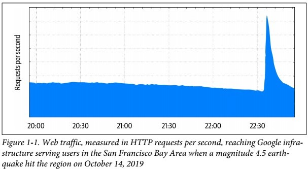

# 第一部分

### 入门资料（Introductory Material）

如果你让你的用户来说出他们最喜欢你产品中哪些特点，他们的清单里不太可能会以安全性和可靠性来开头。这两个特征通常都是隐藏在他们的期望里：如果这两点在你的产品中做到了，那么你的用户们通常是不会注意到他们的。

我们确信安全性和可靠性对于任何的组织来说，都是最重要的事情。最终（Ultimately），是没有人会愿意使用一个既不安全又不可靠的产品，因此这些方面将会提供与众不同的业务价值。

本书的第一部分着重介绍安全可靠系统的基础实践部分具有很大的交集，以及您可能在这两者之间需要做出的一些权衡。之后，我们将会为您的潜在对手提供高级指导：他们将如何行动，以及他们的行动将会如何影响到您系统的生命周期。

## 第一章	安全和可靠性的交集

> By Adam Stubblefield, Massimiliano Poletto, and Piotr Lewandowski with David Huska and Betsy Beyer
>
> 以上统统不认识，到时候查下
>
> adversary：对手，有时候感觉读作黑客更好理解吧

### 关于密码和电钻（On Passwords and Power Drills）

2012年的9月27日，Google宣布了一条公告，内部服务中发生了一系列的级联故障。最终，这些故障是由一把电钻恢复了。 

Google有一个内部密码管理器，这个管理器可以让员工们存储和分享来自不支持更好的身份验证机制的第三方服务的一些机密。其中有个机密就是用来连接Google旧金山办公区的大巴上访客WiFi的密码。

9月的那天，公司的运输团队发了一封邮件给员工们说，我们的这个WIFI密码已经换了。接下来就导致了剧增的流量远远超出了密码管理系统所能承受的，因为这个密码管理系统是多年以前开发给一小部分的系统管理员用的，所以根本无法承受。

这些负载导致了密码管理器的主副本节点无法响应，因此负载均衡就把流量分到了从副本节点上，很快从节点也同样挂了。在这时候，系统呼叫了值班工程师。这个工程师也没有处理这种情况的经验：这个密码管理器之前是以最好的支持来维护的，并且在过去的5年里，从来都没有发生过这种停止服务的情况。这个工程师尝试重启这个服务（:smile:果然走到哪里都是遇到问题先重启试试）。但是他不知道重启这服务需要一个硬件安全模块（hardware security module (HSM)）智能卡。

这些智能卡存储在全球不同谷歌办公室的多个保险箱中，但不在值班工程师所在的纽约。当服务重启失败，这个工程师摇人找到了一位澳大利亚的同事帮忙这个取出这个卡帮他重启这个服务。令人失望的是，这位澳大利亚的老铁也没能打开这个保险箱，因为这个组合密码保存在了现在已经挂了的密码管理器中。幸运的是，加州的另一位同事把这个现场保险箱的密码记住了，并拿到了这张卡智能卡。然而，当的工程师将卡插入读卡器后，服务仍然无法重新启动，出现了一个奇怪的错误：“密码无法加载任何保护此密钥的卡（The password could not load any of the cards protecting this key）。”

与此同时，澳大利亚同事决定采取暴力手段来解决这个安全问题，在任务中使用了一把电钻来打开保险箱。一个小时后，这个保险箱被打开了，但是这张新得到的也触发了上面同样的错误消息。

团队在又花了一个小时后才发现，事实上，读卡器的绿灯亮了，并不代表这张卡已经正确地插入。当工程师把卡翻过来再插进去，服务重启成功，故障也结束了。

可靠性和安全性都是一个真正值得信赖的系统的关键组成部分，但是构建既可靠又安全的系统是很困难的。虽然可靠性和安全性的要求有许多共同的特性，但它们也需要不同的设计考虑。人们很容易忽略可靠性和安全性之间的微妙相互作用，这可能会导致意料不到的结果。密码管理器的故障是由一个可靠性问题引发的，这个问题的原因是负载平衡和减载策略做的不好，因为采用了各种各样用来提高系统安全能力的措施，导致后来密码管理器的恢复过程变得很困难。

> #### 安全和隐私的交叉点
>
> 安全和隐私是紧密相关的概念。为了系统尊重用户隐私，这个系统它必须从根本上是安全的，并在对手面前按预期行事。同样，一个完全安全的系统如果不尊重用户隐私，就不能满足许多用户的需求。虽然本书的重点是安全性，但您通常也可以应用我们描述的一般方法来实现隐私目标。

### 可靠性和安全性：设计注意事项

在设计系统的可靠性和安全性的时候，必须考虑不同的风险。主要的可靠性风险本质上是无恶意的——例如，一个坏的软件更新或物理设备故障。然而，安全风险来自于那些积极利用系统漏洞的对手。在为可靠性进行设计时，您可以假定某些东西在某些时候会出错。在为安全性进行设计的时候，你必须假设对手可能在任何时候都在努力把系统搞砸。

因此，不同的系统被设计成以完全不同的方式响应故障。在没有攻击的情况下，系统通常会故障时为安全(或打开):例如，电子锁被设计成在电源故障时保持打开状态，以允许安全通过门。故障安全/开放行为会导致明显的安全漏洞。为了防御可能利用电力故障的对手攻击，您可以将门设计为故障安全，并且在没有电源的情况下保持关闭状态。

> #### 可靠性和安全性的权衡：冗余
>
> 在设计可靠性的时候，您通常需要给系统增加冗余。举个例子，许多的电子锁安全性失效，但在断电的情况下，仍然接受一个物理上的钥匙来打开。同样，逃生通道为紧急情况也会提供多余的出口。而冗余增加了可靠性，同样也会增加了被攻击的风险（attack surface）。一个黑客只需要在一个途径中找到突破，那么他就成功了。

> #### 可靠性和安全性的权衡：事件管理
>
> 对手的存在也会影响到协作的方式和在事件中响应方可用的信息。可靠性事故受益于拥有多个视角的反应者，他们可以帮助快速找到并减轻根本原因。相比之下，您通常希望让最少的人们来处理安全事件，这样对手就不会得到系统恢复的消息（the adversary isn’t tipped off to the recovery effort）。在安全的情况下，您可以分享其他人只需要知道的基础信息，其余的不透露。类似地，大量的系统日志可能会让你知道系统对于事件的响应，并且减少恢复系统的事件，但是，根据记录的日志内容，对于攻击者来说，这些的日志是很有价值的目标。

### 机密性、完整性、可用性（Confidentiality, Integrity, Availability）

安全性和可靠性始终都和系统的机密性、完整性、可用性有关，但是他们从不同的视角来看待这些属性。这两种观点的关键区别在于是否存在恶意对手。一个可靠的系统不应该意外地违反机密性，就像一个有bug的聊天系统可能会错误地传递、篡改或丢失消息一样。此外，安全系统必须防止主动对手访问、篡改或销毁机密数据。让我们看几个例子来说明可靠性问题是如何导致安全问题的。

> #### 这里是一只鸟（说明性文字）
>
> 机密性、完整性和可用性传统上被认为是安全系统的基本属性，被称为CIA三元组。尽管许多其他模型扩展了安全属性集（extend the set of security attributes），但CIA三合组一直很受欢迎。尽管是首字母缩写，但这个概念与中央情报局(cia)没有任何关系。

> 自己在网上找的关于CIA三元组的介绍
>
> [信息安全的核心：CIA三元组 | 安全千字文系列1](https://zhuanlan.zhihu.com/p/27596333)

### 机密性

在航空工业中，在通讯按钮部位卡主的按键通话麦克风是一个值得注意的保密问题。在几起有据可查的案件中，一个卡住的麦克风在驾驶舱内广播飞行员之间的私人对话，这代表着违反了保密规定。在这种情况下，不涉及恶意对手：硬件可靠性缺陷导致设备在飞行员不打算发送语音时发送。

### 完整性

类似地，数据完整性妥协不需要涉及主动的对手。在2015年，谷歌站点可靠性工程师(SREs)注意到对几个数据块的端到端加密完整性检查失败。因为一些处理数据的机器后来显示出无法纠正内存错误的证据，所以SREs决定编写一个软件，通过单比特翻转(0变为1，反之亦然)来详尽地计算每个版本的数据的完整性检查。这样，他们就可以查看其中一个结果是否与原始完整性检查的值匹配。所有的错误实际上都是单比特翻转，SREs恢复了所有的数据。有趣的是，这是一个安全技术在可靠性事故中帮忙的例子。(谷歌的存储系统也使用非加密的端到端完整性检查，但其他问题阻止了SREs检测位翻转。)

### 可用性

最后，当然，可用性既是可靠性问题，也是安全性问题。黑客可能会利用系统的弱点，使系统停止运行，或对授权用户造成损害。或者它们可以控制分布在世界各地的大量设备来执行经典的分布式拒绝服务(DDoS)攻击，让许多设备向受害者发送大量流量。

拒绝服务(DoS)攻击是一个有趣的案例，因为它们跨越了可靠性和安全性两个领域。从受害者的角度来看，恶意攻击可能让人难以区分到底是设计缺陷还是合理的流量峰值。例如，2018年的一次软件更新导致一些Google Home和Chromecast设备在同步时钟时产生了巨大的网络流量峰值，导致Google的中央时间服务器出现了出乎意料的高负载。同样，一个重大的突发新闻或其他事件会促使数百万人发出几乎相同的查询，这看起来很像传统的应用程序级DDoS攻击。如图1-1所示，2019年10月，当旧金山湾区发生4.5级地址的时候时，为该地区服务的谷歌基础设施收到了洪水般的查询。

### 可靠性和安全性：共性

和其他许多的系统特性不同，可靠性和安全性是系统设计的紧急特性。两者都很难在事后确定，所以理想情况下，您应该从最初的设计阶段就将两者考虑进去。它们还需要在整个系统生命周期中进行持续的关注和测试，因为系统变更很容易在无意中影响它们。在一个复杂的系统中，可靠性和安全性能通常是由许多组件的相互作用决定的，一个看起来无害的组件更新最终可能会影响整个系统的可靠性或安全性，而这种影响直到引发事故时才会显现出来。让我们更详细地检查这些共性和其他共性。

### 隐蔽性

当一切顺利的时候，可靠性和安全性几乎是看不到的。但是可靠性和安全性团队的其中一个目标就是赢得并且保持客户和合作伙伴的信任。不仅仅是在遇到问题的时候，还包括在一切运行顺利的情况下，良好的沟通是获取信任的基石。在最大程度上，这些信息是实在和具体的，没有陈词滥调和行话套话。

不幸的是，在没有紧急情况的时候，可靠性和安全性的内在不可见性意味着它们通常被视为可以减少或推迟的成本，而不直接造成后果。然而，可靠性和安全性故障而导致的成本可能会很严重。据媒体报道，在2017年，数据泄露或许导致了Verizon收购雅虎互联网业务的价格下降了3.5亿美元。同年，达美航空(Delta Airlines)的一次停电导致关键计算机系统关机，导致近700架次航班取消和数千次航班延误，达美航空当天的航班吞吐量减少了约60%

### 评估

因为实现完美的可靠性或安全性是不切实际的，所以您可以使用基于风险的方法来估计发生负面事件而导致的成本，以及预防这些事件的预先成本和[机会成本]([https://zh.wikipedia.org/wiki/%E6%9C%BA%E4%BC%9A%E6%88%90%E6%9C%AC](https://zh.wikipedia.org/wiki/机会成本))。但是，为了可靠性和安全性，您应该以不同的方式度量负面事件发生的概率。你可以对系统组成的可靠性进行推理，并根据预期的错误预算[^1]来规划工程上的工作，至少在一定程度上，因为你可以假设单个组件的故障是独立的。这样一个组成的安全性更难评估。分析系统的设计和实现可以提供一定程度的保证。对抗性测试——通常从确定的黑客的角度进行的模拟攻击——也可以用来评估系统对特定类型攻击的抵抗能力、攻击检测机制的有效性以及攻击的潜在后果。

[^1]:更多有关于错误预算的信息，请参考《SRE》的第三章